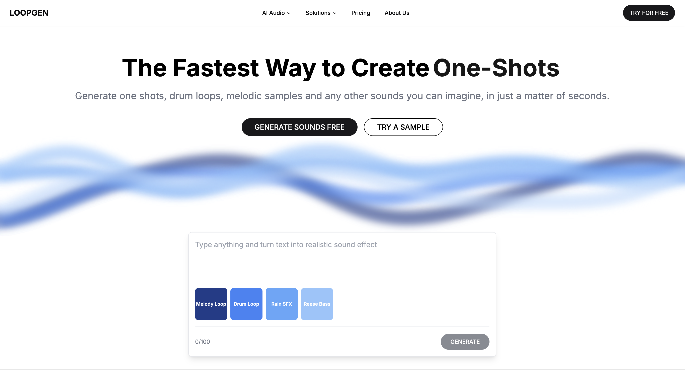

# LOOPGEN - AI-Powered Audio Generation Platform



LOOPGEN is a cutting-edge web application that leverages AI technology to generate custom audio samples, loops, and sounds. Built with Next.js, this platform offers a user-friendly interface for creating unique audio content for music production, sound design, and more.

## Project Overview

LOOPGEN allows users to:

- Generate one-shots, drum loops, melodic samples, and various sounds using text prompts
- Explore AI-generated audio for music production, sound design, film & TV, and game audio
- Access a comprehensive library of AI-created sounds and loops
- Utilize advanced AI models for audio generation

Key features include:

- Text-to-audio generation
- Customizable sound creation
- Extensive sound library
- User-friendly interface
- Secure user authentication
- Cloud storage for user-generated content

## Getting Started

To run the development server:

```bash
npm run dev
# or
yarn dev
# or
pnpm dev
# or
bun dev
```

Open [http://localhost:3000](http://localhost:3000) with your browser to see the application in action.

## Project Structure

- `src/app/(landing)/page.tsx`: Contains the main landing page component
- `src/components/LoopgenInterface.tsx`: Implements the core LOOPGEN interface
- Other components in `src/components/`: UI elements and features

## Technologies Used

- Next.js for the frontend framework
- React for building user interfaces
- TypeScript for type-safe code
- Tailwind CSS for styling
- Radix UI for accessible component primitives
- ElevenLabs API for generating sound effects
- Clerk for user authentication
- Firebase for database and storage

## Learn More

To learn more about the technologies used in this project:

- [Next.js Documentation](https://nextjs.org/docs)
- [React Documentation](https://reactjs.org/)
- [TypeScript Documentation](https://www.typescriptlang.org/docs/)
- [Tailwind CSS Documentation](https://tailwindcss.com/docs)
- [Radix UI Documentation](https://www.radix-ui.com/docs/primitives/overview/introduction)
- [ElevenLabs API Documentation](https://docs.elevenlabs.io/)
- [Clerk Documentation](https://clerk.com/docs)
- [Firebase Documentation](https://firebase.google.com/docs)

## Deployment

This application can be easily deployed on [Vercel](https://vercel.com/), the platform created by the makers of Next.js.

For more information on deploying Next.js apps, check out the [Next.js deployment documentation](https://nextjs.org/docs/deployment).

## Contributing

Contributions to LOOPGEN are welcome! Please feel free to submit issues or pull requests to help improve the application.

## License

[Add your chosen license here]
